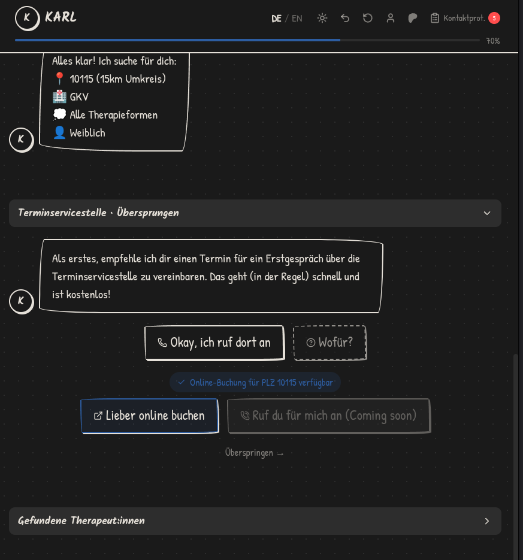
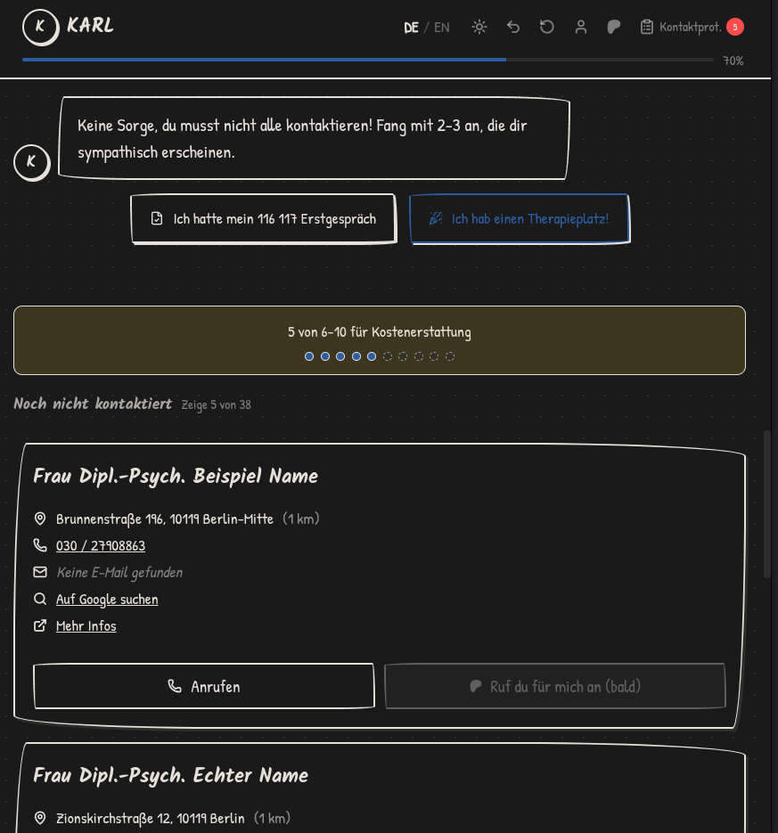

# karl - kontakt automatisierung richtung leben

therapieplatz-finder für deutschland

ja, der name ist genauso sperrig wie das deutsche gesundheitssystem. karl hilft dir dabei, einen therapieplatz zu finden - mit einem geleiteten prozess, therapeutensuche und dokumentation für das kostenerstattungsverfahren.

**live**: [karl-helps.org](https://karl-helps.org)


## screenshots

### landing


### chat


### therapeutensuche



## features

geleiteter prozess durch das kostenerstattungsverfahren basierend auf KBV-richtlinien. therapeutensuche nach PLZ . kontaktprotokoll mit pdf-export für die krankenkasse.

alles bleibt im browser, optional verschlüsselter cloud-sync für patreon-supporter. mobile-optimiert.


### in entwicklung

auto-anrufe über elevenlabs conversational agents batch calling API (tier-gated für supporter). nachverfolgung von anrufen und e-mails.


## tech stack

sveltekit 2 mit svelte 5 runes. tailwind v4. cloudflare pages, d1, kv. paraglide für i18n (de/en). lucia für patreon oauth.


## development

```bash
pnpm install
pnpm dev
pnpm build
```


## mitmachen

bugfixes, feature-vorschläge oder verbesserungen am therapie-leitfaden sind willkommen. öffne ein issue oder reiche einen pull request ein.


---


## english

therapy finder for germany

contact automation regarding life

karl helps you navigate finding a therapy spot in germany with a guided process, therapist search, and documentation for the cost reimbursement process.

**live**: [karl-helps.org](https://karl-helps.org)


### features

guided process through the kostenerstattungsverfahren (cost reimbursement) based on KBV guidelines. therapist search by postal code . contact protocol with pdf export for insurance.

everything stays in your browser, optional encrypted cloud sync for patreon supporters. mobile responsive.


### in development

auto-calling via elevenlabs batch calling API (tier-gated for supporters). smart follow-ups for calls and emails.


### contributing

bug fixes, feature suggestions, or improvements to the therapy guide are welcome. open an issue or submit a pull request.


---

*karl ist eine unabhängige plattform und steht in keiner verbindung zu offiziellen gesundheitsbehörden. alle informationen dienen nur zu informationszwecken.*
