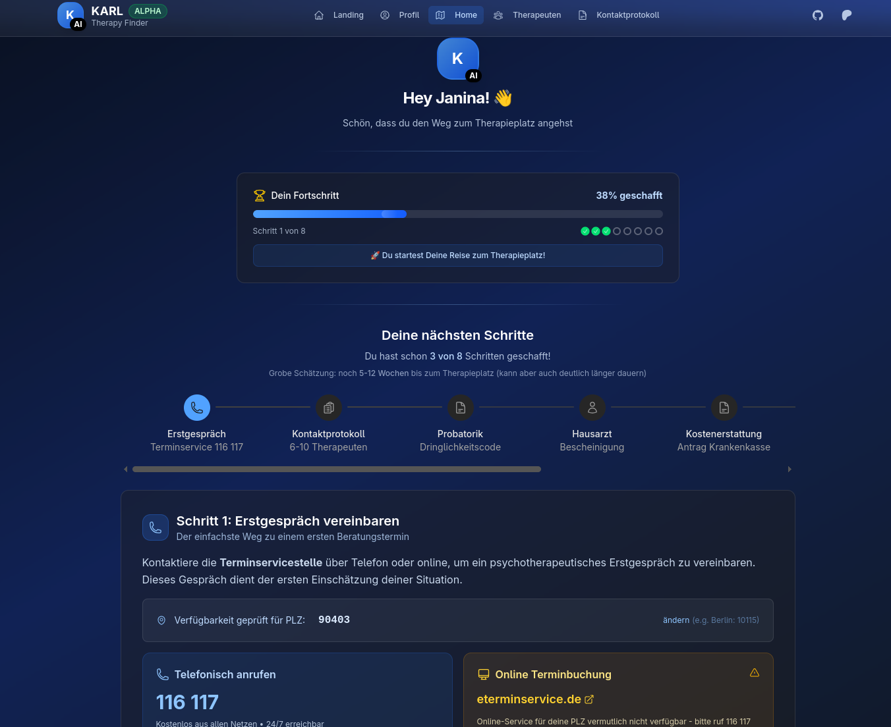

# KARL - Kontakt Automatisierung Richtung Leben

**Therapieplatz-Finder für Deutschland**

Ja, der Name ist genauso sperrig wie das deutsche Gesundheitssystem. KARL hilft dir dabei, einen Therapieplatz in Deutschland zu finden - mit einem geleiteten Prozess und Therapeutensuche.

**Live Demo**: [karl-therapy-finder.merle-cloudflare.workers.dev](https://karl-therapy-finder.merle-cloudflare.workers.dev)  
*Bald auch verfügbar unter karl-helps.org*

## Screenshots

### Therapy Guide


### Landing Page


## Funktionen

### Aktuelle Features
- **7-Schritte-Leitfaden** - Basiert auf KBV-Richtlinien und echten Erfahrungen
- **Therapeutensuche** - Finde Therapeuten nach PLZ mit einfachen Filtern
- **Persönliches Profil** - Speichere deine Präferenzen und verfolge deinen Fortschritt
- **Mobile optimiert** - Funktioniert auf dem Handy, weil du viel telefonieren wirst
- **Datenschutz** - Alles bleibt in deinem Browser, keine Daten werden gesendet
- **Deutschland-spezifisch** - Gemacht für dieses wunderbare bürokratische System

### In Entwicklung
- **Auto-Anrufe** - Lass den Computer die 50+ Anrufe für dich machen
- **E-Mail-Automatisierung** - Sende Terminanfragen automatisch
- **Kontaktprotokoll-Generierung** - Fülle automatisch den nervigen Papierkram für die Krankenkasse aus
- **Intelligente Nachverfolgung** - Verfolge deine Anrufe und E-Mails automatisch

## Tech Stack

- **Framework**: Nuxt.js 3 + Vue.js
- **UI**: Nuxt UI + Tailwind CSS
- **State**: Pinia with localStorage persistence
- **Backend**: Server API routes
- **Database**: SQLite with Drizzle ORM
- **Icons**: Heroicons

## Development

```bash
# Install dependencies
pnpm install

# Start development server
pnpm dev

# Build for production
pnpm build
```


## Mitmachen

Wir freuen uns über Unterstützung! Ob Bugfixes, Feature-Vorschläge oder Verbesserungen am Therapie-Leitfaden - öffne gerne ein Issue oder reiche einen Pull Request ein.

---

## English

**Therapy finder for Germany**

Contact Automation Regarding Life

Yes, the name is as bureaucratic as the German healthcare system itself. KARL helps you navigate finding a therapy spot in Germany with a guided process and therapist search.

**Live Demo**: [karl-therapy-finder.merle-cloudflare.workers.dev](https://karl-therapy-finder.merle-cloudflare.workers.dev)  
*Soon also available at karl-helps.org*

### Features

#### Current Features
- **7-Step Therapy Guide** - Based on actual KBV guidelines and real experiences
- **Therapist Search** - Find therapists by postal code with basic filtering
- **Personal Profile** - Save your preferences and track where you are in the process
- **Mobile Responsive** - Works on your phone because you'll be doing a lot of calling
- **Privacy First** - Everything stays in your browser, no data sent anywhere
- **German Healthcare Focus** - Made specifically for this lovely bureaucratic system

#### In Development
- **Auto-Calling** - Let the computer make those 50+ calls for you
- **Email Automation** - Send appointment requests automatically 
- **Contact Protocol Generation** - Auto-fill that annoying paperwork the insurance wants
- **Smart Follow-ups** - Track your calls and emails automatically

### Contributing

We welcome contributions! Whether it's bug fixes, feature suggestions, or improvements to the therapy guide content, please feel free to open an issue or submit a pull request.

## License

This project is licensed under the [MIT License](./LICENSE) and was built off of [Habit](habit).

---

*KARL ist eine unabhängige Plattform und steht in keiner Verbindung zu offiziellen Gesundheitsbehörden. Alle Informationen dienen nur zu Informationszwecken.*